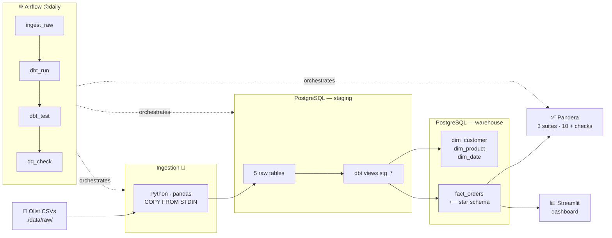

# DataForge — End-to-End Data Engineering Pipeline

> A production-style ELT pipeline built on the Brazilian Olist e-commerce dataset.
> Ingests raw CSVs, models a Kimball star schema with dbt, validates data quality
> with Pandera, orchestrates everything with Airflow, and surfaces KPIs in a
> Streamlit dashboard — all containerised with Docker Compose.


---

## Screenshots

### Streamlit Dashboard


### Airflow DAG — All Tasks Green


### dbt Lineage Graph


### Docker — All Containers Healthy


---

## Architecture



---

## Tech Stack

| Layer | Tool | Version | Role |
|-------|------|---------|------|
| Ingestion | Python · pandas · psycopg2 | 3.12 · 2.2 | CSV → staging via `COPY FROM STDIN` |
| Orchestration | Apache Airflow | 2.9.2 | Daily DAG · LocalExecutor |
| Storage | PostgreSQL | 15 | `staging` + `warehouse` schemas |
| Transformation | dbt-core · dbt-postgres | 1.8.2 | Staging views + star-schema tables |
| Data Quality | Pandera | 0.18.3 | Schema + value validation |
| Dashboard | Streamlit · Plotly | 1.35 · 5.22 | KPI cards + interactive charts |
| Infra | Docker Compose | v2 | Single-command local environment |

---

## Dataset — Olist Brazilian E-commerce

99 k orders · 100 k customers · 33 k products · 2016–2018

Download from Kaggle → place all CSVs in `./data/raw/`:

| File | Rows |
|------|------|
| olist_orders_dataset.csv | 99 441 |
| olist_customers_dataset.csv | 99 441 |
| olist_products_dataset.csv | 32 951 |
| olist_order_items_dataset.csv | 112 650 |
| olist_order_payments_dataset.csv | 103 886 |

---

## Quick Start

### 1 — Clone & configure

```bash
git clone <repo-url> && cd DataForge
cp .env.template .env
```

Generate a Fernet key and paste it into `.env`:

```bash
python -c "from cryptography.fernet import Fernet; print(Fernet.generate_key().decode())"
```

### 2 — Start the pipeline stack

```bash
docker compose up postgres airflow-init airflow-webserver airflow-scheduler -d --build
```

First run downloads images and installs packages — allow ~5 minutes.

### 3 — Verify health

```bash
docker compose ps
# postgres → healthy | airflow-webserver → healthy | airflow-scheduler → running
```

Open **http://localhost:8080** → admin / admin123

### 4 — Run the pipeline

Trigger manually from the Airflow UI **▶ Trigger DAG**, or:

```bash
docker compose exec airflow-webserver airflow dags trigger dataforge_pipeline
```

Watch the graph view: `ingest_raw → dbt_run → dbt_test → data_quality_check`

### 5 — Open the dashboard

```bash
docker compose --profile dashboard up streamlit -d --build
```

Open **http://localhost:8501**

### 6 — dbt docs (lineage graph)

```bash
docker compose exec dbt dbt docs generate \
  --profiles-dir /dbt --project-dir /dbt --target-path /tmp/dbt_target

docker compose exec dbt dbt docs serve \
  --profiles-dir /dbt --project-dir /dbt --target-path /tmp/dbt_target
```

Open **http://localhost:8080** (dbt serves on 8080 inside container — map a port if needed)

---

## Project Structure

```
DataForge/
├── data/raw/                          # Olist CSVs (git-ignored)
├── ingestion/
│   ├── ingest.py                      # CSV → staging.* via psycopg2 COPY
│   └── requirements.txt
├── dbt/
│   ├── dbt_project.yml
│   ├── profiles.yml
│   └── models/
│       ├── staging/                   # Views — one per source table
│       │   ├── sources.yml
│       │   ├── schema.yml
│       │   └── stg_orders.sql …
│       └── marts/                     # Tables — star schema
│           ├── schema.yml
│           ├── dim_customer.sql
│           ├── dim_product.sql
│           ├── dim_date.sql
│           └── fact_orders.sql
├── great_expectations/
│   ├── ge_validate.py                 # Pandera validation script
│   └── expectations/                  # JSON expectation suite docs
│       ├── staging_orders.json
│       ├── staging_order_items.json
│       └── staging_order_payments.json
├── dags/
│   └── dataforge_pipeline.py          # Airflow DAG
├── streamlit/
│   └── app.py                         # KPI dashboard
├── docker/
│   ├── Dockerfile.airflow             # Airflow + pandas + dbt + pandera
│   ├── Dockerfile.dbt
│   ├── Dockerfile.streamlit
│   └── init.sql                       # Creates schemas on first boot
├── docker-compose.yml
├── .env.template
└── README.md
```

---

## Warehouse Design — Kimball Star Schema

```
                    ┌──────────────┐
                    │  dim_date    │
                    │  date_key PK │
                    └──────┬───────┘
                           │
┌───────────────┐   ┌──────┴────────────────────────┐   ┌──────────────┐
│  dim_customer │   │         fact_orders            │   │  dim_product │
│  customer_key ├───┤  order_item_key  PK            ├───┤  product_key │
│  city, state  │   │  customer_key   FK             │   │  category    │
└───────────────┘   │  product_key    FK             │   └──────────────┘
                    │  date_key       FK             │
                    │  ─────────────────────         │
                    │  price          measure        │
                    │  freight_value  measure        │
                    │  payment_value  measure        │
                    └────────────────────────────────┘
```

**Grain:** one row per order item (most granular fact in the dataset).
`payment_value` is the order-level total attached to each item row — use
`SUM(price)` for item-level revenue, `SUM(DISTINCT ...)` for payment totals.

---

## Design Decisions

### ELT over ETL
Load raw data first, transform inside the warehouse with dbt.
Advantages: raw data is always preserved for re-transformation; dbt SQL is
version-controlled, peer-reviewable, and testable; transformations run where
the data lives (no movement overhead).

### Kimball Star Schema
3NF is optimised for writes; star schema is optimised for reads.
Fewer JOINs in analytical queries, intuitive for BI tools, and maps cleanly
to Redshift / BigQuery / Snowflake if the project scales.

### dbt-core
SQL-native transformations with built-in `not_null`, `unique`, and
`relationships` tests. The lineage graph (`dbt docs serve`) makes data
dependencies auditable. Running dbt inside the warehouse avoids serialisation
overhead.

### LocalExecutor for Airflow
No Redis or Celery worker overhead — suitable for a single-node development
environment. Switching to CeleryExecutor for horizontal scaling requires
changing one env var and adding a worker service.

### COPY FROM STDIN for ingestion
pandas `to_sql` uses row-by-row INSERT under the hood.
psycopg2's `copy_expert` uses PostgreSQL's native bulk-load protocol —
typically 10–100× faster for large CSVs. Idempotency is achieved via
`DROP TABLE … CASCADE` + `CREATE TABLE` on every run.

### Pandera over Great Expectations
`great-expectations==0.18.x` has a Python 3.12 incompatibility in its
pydantic v1 dependency (`ForwardRef._evaluate` signature change).
Pandera provides equivalent column-level schema validation (nullability,
uniqueness, value ranges, categorical sets) with a clean Pythonic API and
full Python 3.12 support.

### md5() surrogate keys in dbt
Stable across pipeline re-runs (unlike `ROW_NUMBER()`), no sequence
dependency, and enables idempotent incremental loads in the future.

---

## Airflow DAG

```
dataforge_pipeline  @daily  catchup=False  retries=2

ingest_raw ──► dbt_run ──► dbt_test ──► data_quality_check
  │              │            │                │
PythonOp      BashOp       BashOp          PythonOp
pandas COPY   dbt run      dbt test        Pandera
              9 models     44 tests        3 suites
```

---

## Data Quality — Pandera Suites

| Suite | Checks |
|-------|--------|
| staging_orders | order_id not-null · unique · order_status in valid set · table not empty |
| staging_order_items | order_id / product_id not-null · price ≥ 0 · freight_value ≥ 0 · table not empty |
| staging_order_payments | order_id not-null · payment_value ≥ 0 · payment_type in valid set · table not empty |

Pipeline fails automatically if any check fails.

---

## Dashboard — Streamlit

| Section | Content |
|---------|---------|
| KPI cards | Total Revenue · Total Orders · Avg Order Value · Top Category |
| Line chart | Monthly revenue trend |
| Bar chart | Top 10 product categories by revenue |
| Bar chart | Revenue by Brazilian state |
| Sidebar | Date-range picker · State multiselect |

---

## Portfolio — Talking Points

Key points to highlight when presenting this project:

- **End-to-end ownership** — ingestion → modelling → quality → visualisation, one repo
- **44 dbt tests** pass on every pipeline run (not_null, unique, relationships, accepted_values)
- **Idempotent pipeline** — safe to re-run; `DROP … CASCADE` + dbt `replace` strategy
- **COPY FROM STDIN** for ingestion — 10–100× faster than row-by-row INSERT
- **Star schema** designed for BI queries — fewer JOINs, maps to Redshift/BigQuery/Snowflake
- **LocalExecutor → CeleryExecutor** — one config change to scale horizontally

---

## Phase Completion

| Phase | Description | Status |
|-------|-------------|--------|
| 1 | Scaffold · Docker · Postgres · Airflow setup | ✅ |
| 2 | Ingestion — CSV → staging schema | ✅ |
| 3 | dbt staging + mart models + 44 tests | ✅ |
| 4 | Airflow DAG — end-to-end orchestration | ✅ |
| 5 | Pandera data quality checks | ✅ |
| 6 | Streamlit KPI dashboard | ✅ |
| 7 | Portfolio polish | ✅ |
